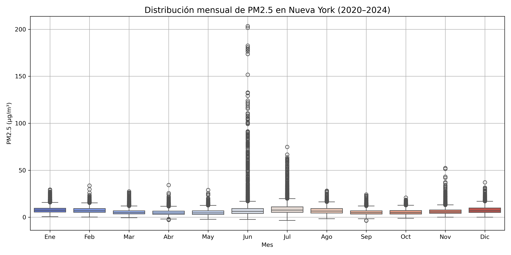
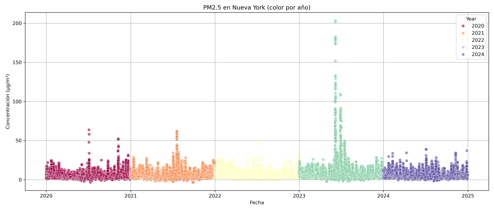
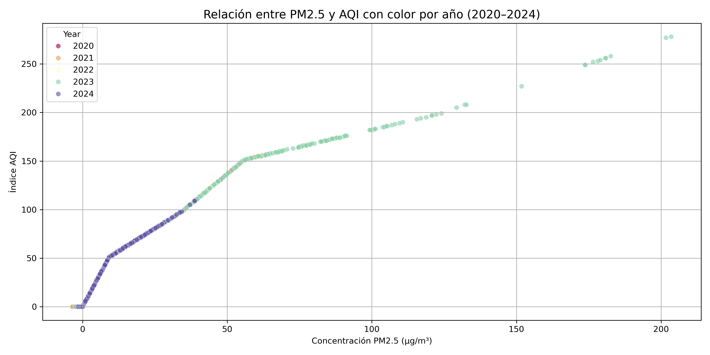
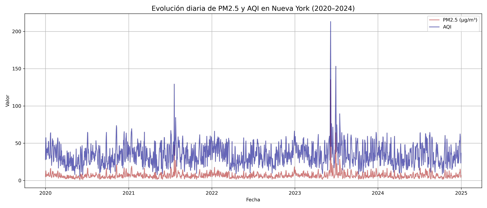

## 🧪 Proyecto: Calidad del aire en Nueva York (2020–2024)

Análisis exploratorio y visualización de los niveles de PM2.5 y el Índice de Calidad del Aire (AQI) en Nueva York. El objetivo es entender comportamientos estacionales, correlaciones sanitarias y visualizar patrones ambientales invisibles.

---

## 📁 Estructura del repositorio

nyc-air-quality-analysis/ ├── proyecto_pm2.5_new_york.ipynb # Notebook principal ├── README.md ├── data/ # Archivos CSV con datos por año │ ├── air_quality_2020.csv │ ├── air_quality_2021.csv │ └── ... └── images/ # Visualizaciones exportadas ├── scatter_pm25_vs_aqi.png ├── line_pm25_aqi.png ├── boxplot_pm25_month.png └── scatter_pm25_years.png

## 📊 Visualizaciones destacadas

### 🔹 Boxplot mensual de PM2.5



Un vistazo a la dispersión, outliers y comportamiento estacional de PM2.5 en Nueva York. El invierno y verano muestran concentraciones elevadas.

---

### 🔹 Dispersión diaria de PM2.5 por año



Visualización detallada de cada día y año, donde 2023 se distingue con picos extraordinarios de contaminación.

---

### 🔹 Relación entre PM2.5 y AQI por año



Cada punto representa un día, con color según el año. Se observa cómo los niveles de PM2.5 elevan proporcionalmente el riesgo sanitario medido por el AQI.

---

### 🔹 Evolución temporal de PM2.5 vs AQI



Este gráfico muestra cómo varían diariamente la concentración de partículas (PM2.5) y el Índice de Calidad del Aire (AQI) en Nueva York entre 2020 y 2024. Los picos paralelos revelan una correlación directa entre ambos indicadores.

---

## 📓 Notebook

Puedes ver todo el análisis y código en el notebook:  
👉 [`proyecto_pm2.5_new_york.ipynb`](proyecto_pm2.5_new_york.ipynb)

---

## 📄 Datos utilizados

Los datos provienen de fuentes públicas sobre calidad del aire y contienen los valores diarios de PM2.5 y AQI en Nueva York entre 2020 y 2024. Cada archivo `.csv` representa un año, con columnas como:

- `Date`
- `PM2.5`
- `AQI`
- `Year`

---

## ⚙️ Cómo ejecutar el notebook

Requisitos:

- Python 3.8+
- Librerías: `pandas`, `matplotlib`, `seaborn`

Instalación rápida:

```bash
pip install pandas matplotlib seaborn
